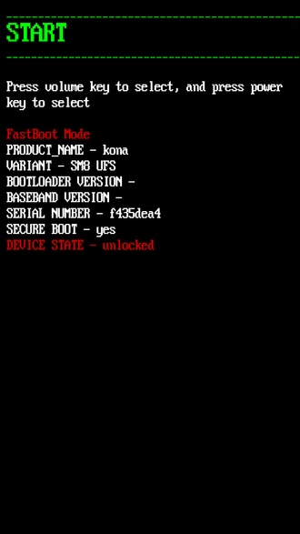

# Unbrick-Downgrade-Upgrade-Oppo-Realme-Devices

<br/>

> **Note**
> - If you have any problem to your device please visit **SERVICE CENTRE**, Realme/Oppo have good service Centre and if problem is not related to hardware, it is very cheap (**Service Charge + Software Problem = (INR 180)
> - Problem Likes : hang, slow, fingerprint not working, etc.
> - Just want to SAY **GOOO.... SERVICE CENTRE**

<br/>

> **Warning**
> - If you are not Techy, please **STAY AWAY**.
> - If you are Tech Enthusiast and have Secondary Devices then only you should play around with devices if not you might get in trouble.
> Try This **AT YOUR OWN RISK**.

<br/>

## Features
- You can Unbrick Your Device (Oppo/Realme).
- You can Downgrade to your favourite Android Version.
- You Can Upgrade to your favourite Android Version.

<br/>

## Unbrick
- If your phone got soft bricked then only you can unbricked it.
- To check it
    - if you can boot in fastboot mode then we can unbricked it.
    - switch off phone then press (Power key + Volume Down key) simultaneously for (5 to 7 seconds) or until you see realme/oppo logo.
      **OR**
    - if you can't switch off then press ( Power key + Volume Down key + Volume Up key) Simultaneously for 10 to 15 seconds.
- It doesn't matter if it automatically boot in fastboot mode again and again like ( Screen off then fastboot screen off then ......)

<br/>



<br/>

# STEPS
1. Your Device's bootloader should be unlock. if already have the skip this step.
        ## To unlock bootloader
        - google it or youtube tutorial
        ```
        how to unlock bootloader in {device name}
        ```
3. Now install python 
   1. click -> [download python](https://www.python.org/downloads/)
   2. **OR** google it or click -> [youtube tutorial](https://www.youtube.com/watch?v=bjE7XQV4s-k) on how to install python
   3. if you face any [difficulty](https://youtu.be/lezhrFdVSVY) while installing **USE YOUR BRAIN GO RESEARCH IT**
  
4.  
        

