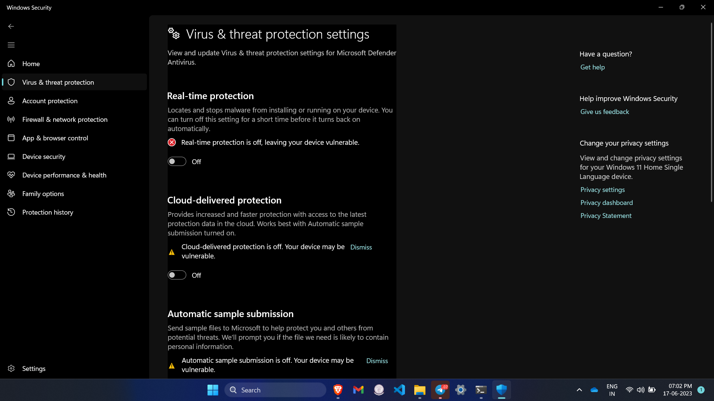

# Unbrick-Downgrade-Upgrade-Oppo-Realme-Devices

<br/>

> **Note**
> - If you have any problem to your device please visit **SERVICE CENTRE**, Realme/Oppo have good service Centre and if problem is not related to hardware, it is very cheap (**Service Charge + Software Problem = (INR 180)
> - Problem Likes : hang, slow, fingerprint not working, etc.
> - Just want to SAY **GOOO.... SERVICE CENTRE**

<br/>

> **Warning**
> - If you are not Techy, please **STAY AWAY**.
> - If you are Tech Enthusiast and have Secondary Devices then only you should play around with devices if not you might get in trouble.
> Try This **AT YOUR OWN RISK**.

<br/>

## Features
- You can Unbrick Your Device (Oppo/Realme).
- You can Downgrade to your favourite Android Version.
- You Can Upgrade to your favourite Android Version.

<br/>

## Unbrick
- If your phone got soft bricked then only you can unbricked it.
- To check it
    - if you can boot in fastboot mode then we can unbricked it.
    - switch off phone then press (Power key + Volume Down key) simultaneously for (5 to 7 seconds) or until you see realme/oppo logo.
      **OR**
    - if you can't switch off then press ( Power key + Volume Down key + Volume Up key) Simultaneously for 10 to 15 seconds.
- It doesn't matter if it automatically boot in fastboot mode again and again like ( Screen off then fastboot screen off then ......)

<br/>


<br/>

# STEPS

1. Your Device's bootloader should be unlock. if already have the skip this step.
   ## To unlock bootloader
   - google it or youtube tutorial
   -  ```
      how to unlock bootloader in {device name}
      ```
2. Now install python
   1. click -> [download python](https://www.python.org/downloads/)
   2. **OR** google it or click -> [youtube tutorial](https://www.youtube.com/watch?v=bjE7XQV4s-k) on how to install python
   3. if you face any [difficulty](https://youtu.be/lezhrFdVSVY) while installing **USE YOUR BRAIN GO RESEARCH IT**
  
3. Now install [git](https://git-scm.com/)  **OR** follow  [tutorial (method 2nd)](https://linuxhint.com/upgrade-git-latest-version-windows/)
4. now install [fastboot drivers](https://forum.xda-developers.com/t/official-tool-windows-adb-fastboot-and-drivers-15-seconds-adb-installer-v1-4-3.2588979/) or search youtube tutorial
5. now install [OppoRealme-OFP-Flash tool](https://github.com/italorecife/OppoRealme-OFP-Flash) by git clone
    1. open terminal where you want to install program
    2.  example on desktop => ```go to desktop -> click right with mouse/pad -> select open terminal -> copy the command written below -> paste the command in terminal ```
    3.   ```
         git clone https://github.com/italorecife/OppoRealme-OFP-Flash
         cd OppoRealme-OFP-Flash
         pip3 install -r requirements.txt
         ```
   4. Now download stock rom/ofp file for your device by searching on [Oppo Stock Rom](https://oppostockrom.com/)
   5. ''' extract rom/ofp by winrar or any other extractor -> then open folder find firmware folder -> find (.ofp) extension file -> cut/copy that file and place in  OppoRealme-OFP-Flash ```
   
   6. now go to  start search **windows Security** and off all the security
      
      
      
      
      
      
   8.  ``` open OppoRealme-OFP-Flash folder -> type cmp to open terminal on upper bar -> type python flash.py ```
      
      

   9. ```
      python flash.py
      ```

   10. if upper command not work then type
      ```
      python3 flash.py
      ```

   11. 
   12. if asked region then choose your region and connect your phone to laptop in fastboot mode
   13. if your phone is fastboot not stable i.e it get off on off on then you have to press unpress volume down key to not go in fastboot loop.
   14. if your android version before unbrick/previous is same to your downloader stock rom version then you just have to ``` start from fastboot (phone) ``` thats it, it may now your phone unbricked.
   15. now **ON** all the security setting which we have off it.
   16. if not then you have to install custom recovery for your downloaded ofp android version (example if you have downloade android 12 stock rom then you have to flash android 12 custom recovery).
   17. now you just have to flash and rom (.ozip or zip) (may be custom or stock).

> **Warning**
> 1. Don't flash this .img
>    1. ``` persist.img -> fingerprint will not work, etc ```
>    2. ``` "oppodycnvbk", "oppostanvbk" -> imei number will get lost ```
>    3. ``` blacklist = ["ocdt", "oppodycnvbk", "oppostanvbk", "opporeserve1", "modem", "persist"] #Partitions with potential risk of HardBrick, IMEI loss and sensors miscalibration ```
> 2. Don't Play with flash.py file if you don't have knowledge (upper 3 points should keep in mind.)
> 3. 
